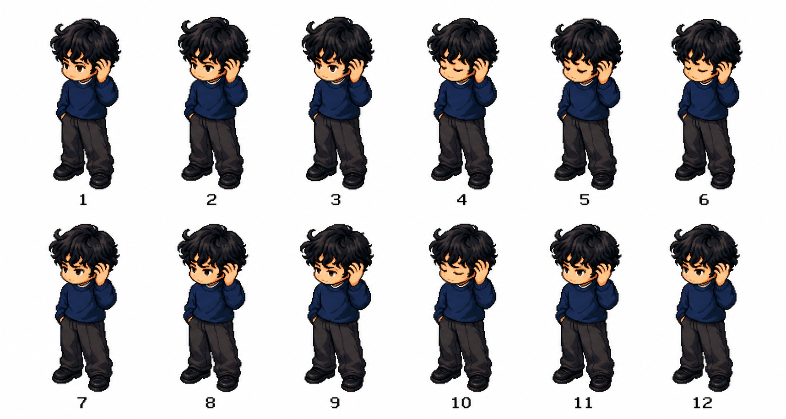
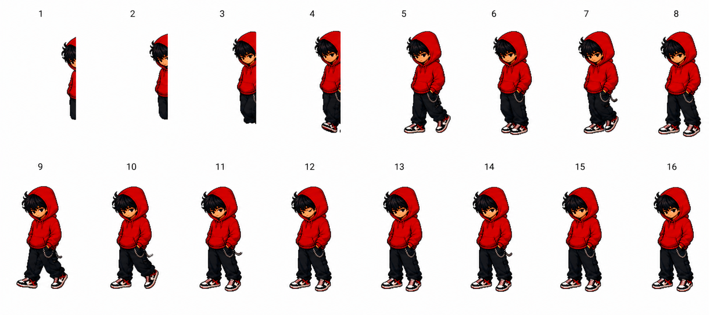
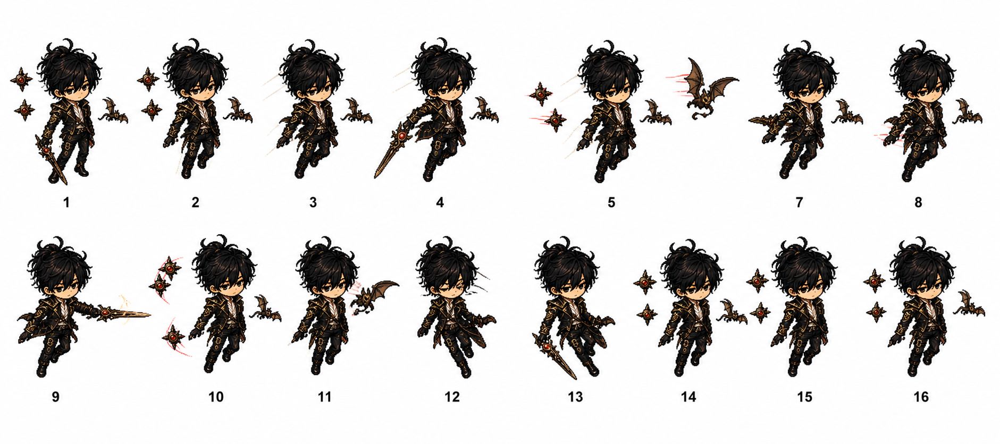

# 周杰伦 Apple Music 音乐桌面宠物

把周杰伦 16 张专辑做成会跟着 Apple Music 一起变化的 macOS 桌面宠物。

当你在 Apple Music 播放周杰伦的歌时，桌面上的角色会根据当前专辑自动切换；它会动、会显示歌词气泡，也能直接在桌面上帮你做播放控制。

## 动作预览

<p align="center">
  
  
</p>
<p align="center">
  
  
</p>

上面这 4 张图不是宣传海报，而是项目里真实在用的动作帧表，分别展示了：

- 同名专辑的待机动作
- 《范特西》的入场动作
- 《魔杰座》的拖动动作
- 《最伟大的作品》的离场动作

## 产品效果

- 听到哪张专辑，桌宠就切到哪张专辑的人物形象
- 支持 `idle / enter / exit / dragging` 四类动作
- 桌面上直接控制 `播放 / 暂停 / 上一首 / 下一首 / 打开 Music`
- 歌词气泡会跟着角色位置走
- 所有源码、角色原图、动作帧表、处理后资源、配置文件都在仓库里

## 适合谁看

- 想看一个完整的 `Apple Music + macOS 桌宠` 产品实现
- 想参考 `SwiftPM + AppKit + Apple Events` 的桌面产品做法
- 想研究“素材源文件 -> 处理脚本 -> 运行时资源”这一整条链路
- 想继续改角色、改动作、改专辑映射、改产品表现

## 演示与介绍

- 小红书产品介绍：  
  [我把周杰伦 16 张专辑做成了音乐桌面宠物](http://xhslink.com/o/2Lf1Gwskm9h)

如果你是先从 GitHub 进来的，建议先看一遍上面的演示，再回来看代码和资源结构，会更容易理解这个项目在做什么。

## 仓库里有什么

```text
assets/
  album-character-concepts/      16 张专辑角色原图
  animated-album-sheets/         每张专辑的动作帧表

app/
  Package.swift
  Sources/JayPetApp/             macOS 应用源码
  Sources/JayPetApp/Resources/   运行时资源、动作帧、配置文件
  scripts/                       资源处理、校验、运行、打包脚本

docs/
  product-brief-zh.md
```

## 核心亮点

### 1. 专辑识别驱动角色切换

应用会读取 Apple Music 当前播放曲目的信息，用专辑名和歌曲兜底映射来判断应该显示哪一个角色。

### 2. 素材链路是完整开放的

不是只开源可执行代码，仓库里把这几层都放出来了：

- 原始角色图
- 原始动作帧表
- 自动处理脚本
- 处理后的运行时资源
- 专辑配置、歌曲映射、气泡定位规则

### 3. 不是单纯展示图，而是真能跑的桌面产品

这个仓库不是“产品截图仓库”，而是可以直接构建、直接运行、直接继续开发的完整项目。

## 环境要求

- macOS 13 或更高版本
- 已安装 Apple Music
- Swift 6.1，或带 SwiftPM 的 Xcode
- Python 3.10+
- 如果要重新处理素材，需要安装 Pillow

安装 Pillow：

```bash
python3 -m pip install Pillow
```

## 快速运行

直接构建并运行：

```bash
cd app
swift run JayPetApp
```

运行资源校验：

```bash
cd app
python3 scripts/validate_resources.py
```

用脚本一键启动：

```bash
cd app
./scripts/build_and_run.sh --verify
```

## 首次权限提示

这个项目通过 Apple Events 和 `osascript` 控制 Apple Music。

第一次运行时，如果系统弹出权限提示，请允许它控制 `Music`。如果发现播放状态没有同步，按下面路径检查：

1. 打开 `系统设置`
2. 进入 `隐私与安全性`
3. 打开 `自动化`
4. 确认相关应用或终端已经被允许控制 `Music`

## 如果你想继续改

重新生成处理后的专辑角色图：

```bash
cd app
python3 scripts/process_album_art.py
```

重新生成某张专辑的动作资源：

```bash
cd app
python3 scripts/process_animation_sheets.py \
  --source-dir ../assets/animated-album-sheets/jay \
  --album-id jay \
  --display-name Jay \
  --force
```

这个脚本会把运行时动作帧写到：

```text
app/Sources/JayPetApp/Resources/album_animations/<album_id>/
```

QA 预览图会写到：

```text
app/build/animation_qa/
```

## 本地打包

把应用打包到 `~/Applications`：

```bash
cd app
./scripts/package_app.sh
```

## 开源说明

- 代码使用 [MIT License](LICENSE)
- `assets/` 与 `app/Sources/JayPetApp/Resources/` 里的视觉素材使用 [CC BY 4.0](LICENSE.assets)

额外说明见 [NOTICE](NOTICE)。

## 最后

如果你觉得这个项目有意思，可以：

- 直接拿去跑
- 拿去改成你自己的音乐桌宠
- 拿去研究 macOS 桌面产品和资源工程化做法

也欢迎先看演示，再回来读代码：

[我把周杰伦 16 张专辑做成了音乐桌面宠物](http://xhslink.com/o/2Lf1Gwskm9h)
